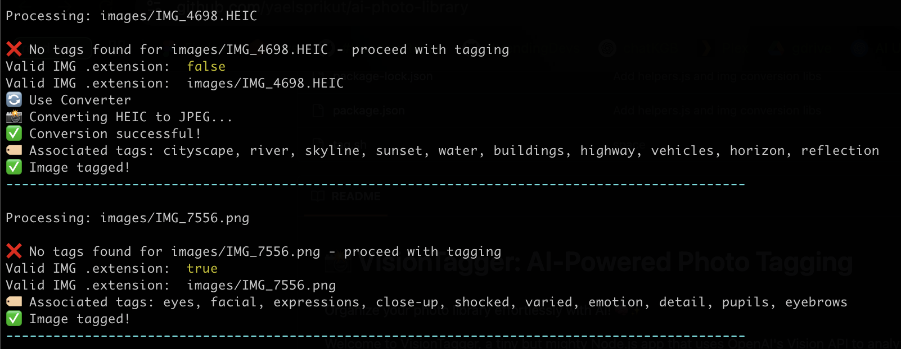

# 📸 VisionTagger: AI-Powered Photo Tagging
Organize your photo library effortlessly with AI! 🧠✨

Welcome to VisionTagger, a tiny but mighty Node.js app that uses OpenAI's Vision API to analyze your photos and tag them with descriptive keywords—so you can search your memories with ease!

## 🌟 Features
* ✅ Automatically analyzes photos using OpenAI's Vision API.
* ✅ Generates descriptive tags for better searchability. 🔍
* ✅ Works on any photo library—point it to a folder & go! 🗂️
* ✅ Super lightweight—just install & run! 🚀

## 🔧 Prerequisites
You must have [exiftool](https://exiftool.org/) installed on your local OS environment. 

## 🚀 Usage
To tag all photos in your library, just run:

```bash
 $ npm i
 $ sh tag.sh
```
To run the location* scripts, you must create a virtual env and install [geopy](https://geopy.readthedocs.io/en/stable/)
```bash
 $ python3 -m venv venv
 $ source venv/bin/activate
 $ python3 -m pip install geopy
```

Output:

And boom! 💥 Your photos will be scanned, and each image will get AI-generated tags for easy searching! 🎯✨

